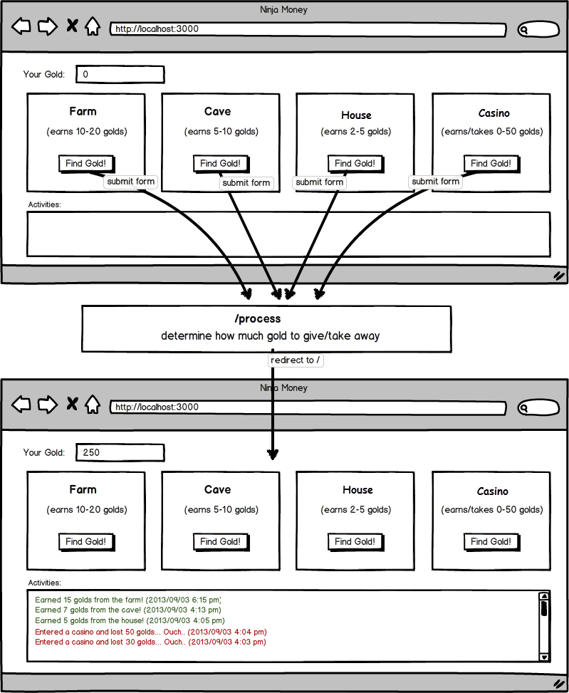

# Ninja Gold Game

You're going to create a mini-game that helps a ninja make some money!
When you start the game, your ninja should have 0 gold.
The ninja can go to different places (farm, cave, house, casino) and earn different amounts of gold.
In the case of a casino, your ninja can **earn** or **lose** up to 50 gold.
Your job is to create a web app that allows this ninja to earn gold and to display past activities of this ninja.

### Guidelines:
* Refer to the wireframe below.
* Have a controller called **Rpg**.
* Have 4 buttons / forms in your project that map to a method in your **rpg controller: farm, cave, casino, house**
* You should send each different user action to a different method in your RpgController.
* Have your controller determine how much gold the user should have and use session effectively.

Do NOT store the activity log in the database.
Just save these logs in sessions.
