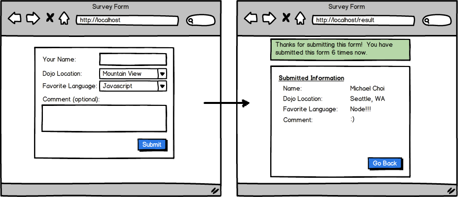

# Survey Form

Your next assignment is to build a new rails project to do what's shown below. For any web app, it's critical that you understand how **forms** can be submitted and how **post** data and **session** data work. Understanding these core concepts is critical to building any web app. As you build the app described below, make sure you feel very comfortable with how information can be relayed between the form, controller, and the views and how session and post data are being handled in Rails.

**Note: *process* is a reserved word in Rails. Do not call a controller method *process*, or suffer the pain!**

For this project, we want you to use *'rails-footnotes'* gem (refer to https://github.com/josevalim/rails-footnotes for how to do this). Do this without using a simple form gem. For the message in the green box, use **'flash'** instead of session.
